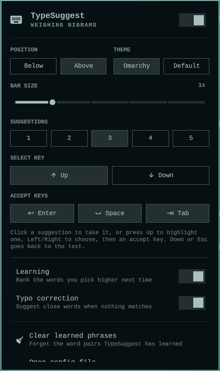

# TypeSuggest for Omarchy

An [Omarchy](https://omarchy.org) 4 (Quattro) shell plugin for
[TypeSuggest](typesuggest/README.md), the Wayland input method that shows
Windows-style word suggestions at the text cursor while you type. The
TypeSuggest source lives in this repository too, in [`typesuggest/`](typesuggest/).

<p align="center"></p>

## Install

1. Add the plugin and put it on the bar:

   ```bash
   omarchy plugin add https://github.com/AbdulrahmanHR/omarchy-typesuggest --enable
   ```

   Omarchy asks before cloning, then asks where on the bar the icon goes (the
   right side by default). Plugins run as unsandboxed code inside the Omarchy
   shell, so read the code before you enable it.

2. Click the new keyboard icon in the bar, choose **Install TypeSuggest**, and
   confirm in the terminal that opens. It installs and starts TypeSuggest, then
   offers to turn on suggestions in browsers, Electron apps and Qt apps (see
   [What the Install button does](#what-the-install-button-does)).

That's it: start typing in any text field. If you added the plugin without
enabling it, enable it with
`omarchy plugin enable io.github.abdulrahmanhr.typesuggest`.

## The panel

It adds a keyboard icon to the Omarchy bar. The icon is dimmed while
TypeSuggest is off, and its tooltip says whether it is on. Clicking it opens a
panel styled like Omarchy's own panels:

- An on/off switch. It starts or stops the TypeSuggest service and turns
  autostart on or off to match, so the setting survives a log out.
- Quick settings: where the suggestion bar sits (below or above the cursor),
  bar size (0.75x to 2x), how many suggestions to show (1 to 5), which keys
  accept a suggestion (Enter, Space, Tab; at least one stays on), learning,
  typo correction, and colors (follow the Omarchy theme, or TypeSuggest's
  default palette).
- **Clear learned phrases**, after a confirmation.
- **Open config file**, which opens `~/.config/typesuggest/config.toml` in your
  editor the way Omarchy opens its own config files.

Changes apply the next time a text field is focused; there is no restart.

If TypeSuggest is not installed, the panel explains what it is and offers an
**Install TypeSuggest** button (see [below](#what-the-install-button-does)).

## Requirements

- Omarchy 4 (Quattro), with the default `omarchy.bar` (or another bar that
  hosts bar widgets).
- TypeSuggest itself. The panel's **Install TypeSuggest** button sets it up
  (see [below](#what-the-install-button-does)), or build it from
  [`typesuggest/`](typesuggest/README.md). The quick settings need a build
  whose `typesuggest --help` lists `--config-json` and `--set` (1.0.0 and
  later); with an older build the panel still has the on/off switch, but asks
  you to update before it shows the settings.

### External dependencies

The plugin itself is QML only and makes no network connections. It runs these
programs, all of which Omarchy already ships except TypeSuggest itself:

| Program | Used for |
|---|---|
| `typesuggest` (installed to `~/.local/bin` by the Install button) | Reading and changing settings, autostart, clearing learned phrases |
| `systemctl` (systemd user session) | Service state, start and stop |
| `sh` | The installed check (`command -v typesuggest`) |
| `omarchy-launch-config-editor` | **Open config file** |
| `omarchy-launch-floating-terminal-with-presentation`, `bash` | **Install TypeSuggest** |
| `curl`, `sha256sum`, `jq`, `install`, `grep`, `gum` | Inside the install and uninstall scripts |

## Using it

While suggestions are showing, press <kbd>Up</kbd> to highlight the first one,
<kbd>Left</kbd>/<kbd>Right</kbd> to move between them, and <kbd>Enter</kbd>,
<kbd>Space</kbd> or <kbd>Tab</kbd> to accept. <kbd>Up</kbd>, <kbd>Down</kbd>
or <kbd>Esc</kbd> backs out. If <kbd>Down</kbd> feels more natural (the bar
sits below the caret by default), pick it under **Select key** in the panel.
Both key rows can be changed there; every key is listed under **Controls &
Keybindings** in [`typesuggest/README.md`](typesuggest/README.md).

- **Left click** the icon: open the panel.
- **Right click** the icon: turn TypeSuggest on or off.

In the panel, as in Omarchy's other panels: `j`/`k` or the arrow keys move
between rows, `h`/`l` move within a row (and step the bar size),
`Enter`/`Space` activate, `t` turns TypeSuggest on or off, `r` reloads the
state, `Tab` switches to the next bar panel, and `Esc` closes it.

The panel reads the state each time it opens. While the icon is on the bar it
also checks whether the service is running every 30 seconds, so the icon
follows changes made elsewhere (for example `typesuggest --toggle` on a
keybinding). The interval is the widget's `refreshIntervalSec` setting (5 to
3600 seconds).

## What the plugin runs

Every command is started as an argument list, never through a shell that
re-reads values, and every value comes from a fixed set of choices in the
panel.

| Action | Command |
|---|---|
| Is it installed? | `sh -c 'command -v typesuggest'` |
| Does this build support the settings? | `typesuggest --help` |
| Is it on? | `systemctl --user is-active typesuggest` |
| Read the settings | `typesuggest --config-json` |
| Change a setting | `typesuggest --set <key> <value>` with `bar_position`, `bar_scale`, `max_candidates`, `select_key`, `accept_keys`, `learn`, `typo_correction` or `theme` |
| Turn on | `typesuggest --enable-autostart`, then `systemctl --user start typesuggest` |
| Turn off | `systemctl --user stop typesuggest`, then `typesuggest --disable-autostart` |
| Clear learned phrases | `typesuggest --clear-learned` (TypeSuggest restarts its service so the daemon forgets them too) |
| Open config file | `omarchy-launch-config-editor ~/.config/typesuggest/config.toml` |
| Install TypeSuggest | `omarchy-launch-floating-terminal-with-presentation "bash <plugin dir>/scripts/install-typesuggest.sh"` |

`typesuggest --config-json` is only run after `--help` has shown that the
installed build knows it; older builds ignore unknown options and would start
a second copy of the daemon instead.

## What the Install button does

It opens a floating Omarchy terminal running
[`scripts/install-typesuggest.sh`](scripts/install-typesuggest.sh). The script
first prints every step and how to undo it, and changes nothing unless you
confirm. Then it:

1. Downloads the TypeSuggest binary for this plugin version from this
   repository's GitHub release (`typesuggest-x86_64`, built and tested from
   [`typesuggest/`](typesuggest/) by the
   [Release workflow](.github/workflows/release.yml)) and **installs it only
   if its SHA-256 matches** the value committed in
   [`release/typesuggest-x86_64.sha256`](release/typesuggest-x86_64.sha256).
   It goes to `~/.local/bin/typesuggest`; no root access is needed.
2. Turns off Fcitx5: `systemctl --user disable --now omarchy-fcitx5.service`.
   Only one input method can run at a time, and Omarchy starts Fcitx5 by
   default. Fcitx5 also provides Omarchy's CapsLock compose sequences
   (`~/.XCompose`), which stop working while it is off.
3. Starts TypeSuggest and enables it on login:
   `typesuggest --enable-autostart`, then `systemctl --user restart typesuggest`.
4. Offers to turn on suggestions in apps that need one extra setting, and
   asks again before changing anything. It lists every file first:
   - Chromium-based browsers and Electron apps: adds `--enable-wayland-ime` to
     the flags file of each one that is installed or already has a flags file
     (`~/.config/chromium-flags.conf`, `brave-flags.conf`, `chrome-flags.conf`,
     `code-flags.conf`, `electron-flags.conf`, `electronNN-flags.conf`), unless
     the flag is already there. Takes effect when the app is fully restarted.
   - Qt apps: Omarchy points them at Fcitx5 (`QT_IM_MODULE=fcitx`), so it writes
     `QT_IM_MODULE=wayland` to `~/.config/environment.d/90-typesuggest.conf`.
     Takes effect at the next login.

   It records what it changed in `~/.local/state/typesuggest/app-settings`, so
   the uninstall script undoes exactly that. Without step 4, suggestions show up
   in terminals and GTK apps only (see
   [App compatibility](typesuggest/README.md#-app-compatibility)).

It stops at the first failed step. The binary is the only download, nothing is
piped into a shell, and nothing outside the files listed above is changed.
Prebuilt binaries are x86_64 only; on other machines build from source.

## Remove

Remove the plugin:

```bash
omarchy plugin remove io.github.abdulrahmanhr.typesuggest
```

Remove TypeSuggest itself with
[`scripts/uninstall-typesuggest.sh`](scripts/uninstall-typesuggest.sh) (run it
from the plugin folder, `~/.config/omarchy/plugins/io.github.abdulrahmanhr.typesuggest/`
before removing the plugin). It stops the service, deletes the program, undoes
the app settings from step 4, and asks before turning Fcitx5 back on and before
deleting your settings and learned phrases. By hand:

```bash
systemctl --user disable --now typesuggest
rm -f ~/.local/bin/typesuggest ~/.config/systemd/user/typesuggest.service
rm -f ~/.config/environment.d/90-typesuggest.conf   # Qt setting from step 4
systemctl --user enable --now omarchy-fcitx5.service
rm -rf ~/.config/typesuggest          # optional: settings and learned phrases
```

and delete the `--enable-wayland-ime` lines step 4 added to the files listed
in `~/.local/state/typesuggest/app-settings`.

## Privacy

The plugin never sees what you type. It only runs the commands listed above
and reads the settings TypeSuggest prints; the only network access is the
binary download in the install script, when you confirm it. TypeSuggest itself
sees every key you press, as any input method must; see
[Privacy & Security](typesuggest/README.md#-privacy--security) for what it
stores and how it detects password prompts.

## What is in this repository

| Path | What it is |
|---|---|
| `manifest.json`, `Panel.qml`, `Service.qml`, `Model.js` | The Omarchy plugin (bar icon and panel) |
| `scripts/` | Install and uninstall scripts used by the panel |
| `typesuggest/` | TypeSuggest source code (Rust) |
| `.github/workflows/release.yml` | Builds and tests `typesuggest/` in an Arch Linux container on every `v*` tag and publishes the binary with its SHA-256 |
| `typesuggest/data/` | Built-in word list, word pairs and word triples, their licenses, and the scripts that build the pairs and triples |
| `release/typesuggest-x86_64.sha256` | The checksum the install script requires, committed after the release build |

## License & credits

The plugin and TypeSuggest's code are [MIT](LICENSE) licensed. The data built into TypeSuggest keeps its own licenses (details and changes in [`typesuggest/data/README.md`](typesuggest/data/README.md)):

- **Word list:** [FrequencyWords](https://github.com/hermitdave/FrequencyWords) by Hermit Dave, from OpenSubtitles 2018: [CC BY-SA 4.0](https://creativecommons.org/licenses/by-sa/4.0/)
- **Word pairs and triples:** built from English sentences by [Tatoeba](https://tatoeba.org) contributors: [CC BY 2.0 FR](https://creativecommons.org/licenses/by/2.0/fr/)

The Rust libraries compiled into the binary are listed with their licenses in [`typesuggest/THIRD_PARTY_LICENSES.md`](typesuggest/THIRD_PARTY_LICENSES.md). Each release includes these notices next to the binary.
